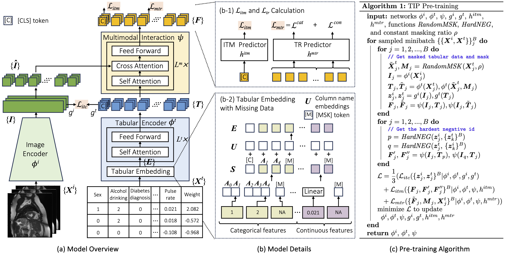

<div align="center">

<h1><a href="https://dl.acm.org/doi/abs/10.1007/978-3-031-72633-0_27">TIP: Tabular-Image Pre-training for Multimodal Classification with Incomplete Data (ECCV 2024)</a></h1>

**[Siyi Du](https://scholar.google.com/citations?user=zsOt8MYAAAAJ&hl=en), [Shaoming Zheng](https://scholar.google.com/citations?user=84zgYXEAAAAJ&hl=en&oi=ao),
[Yinsong Wang](https://orcid.org/0009-0008-7288-4227), [Wenjia Bai](https://scholar.google.com/citations?view_op=list_works&hl=en&hl=en&user=IA1QFM4AAAAJ&sortby=pubdate), [Declan P. O'Regan](https://scholar.google.com/citations?user=85u-LbAAAAAJ&hl=en&oi=ao), and [Chen Qin](https://scholar.google.com/citations?view_op=list_works&hl=en&hl=en&user=mTWrOqHOqjoC&pagesize=80&sortby=pubdate)** 


[](#License)
[](https://arxiv.org/abs/2407.07582)

</div>


<p align="center">Model architecture and algorithm of TIP: (a) Model overview with its image encoder, tabular encoder, and multimodal interaction module, which are pre-trained using 3 SSL losses: $\mathcal{L}_{itc}$, $\mathcal{L}_{itm}$, and $\mathcal{L}_{mtr}$. (b) Model details for (b-1) $\mathcal{L}_{itm}$ and $\mathcal{L}_{mtr}$ calculation and (b-2) tabular embedding with missing data. (c) Pre-training algorithm.</p>

This is an official PyTorch implementation for [TIP: Tabular-Image Pre-training for Multimodal Classification with Incomplete Data, ECCV 2024][1]. We built the code based on [paulhager/MMCL-Tabular-Imaging](https://github.com/paulhager/MMCL-Tabular-Imaging). 

Concact: s.du23@imperial.ac.uk (Siyi Du)

Share us a :star: if this repository does help. 

## Updates
[**11/07/2024**] The arXiv paper is released. 

[**08/07/2024**] The code is released.

[**23/10/2024**] The preprocessing code for UKBB is released.

[**31/03/2025**] We have a new paper accepted at CVPR 2025, which proposes a new semi-supervised tabular-image framework (STiL). Please check [this repository](https://github.com/siyi-wind/STiL) for details.

[**21/02/2026**] We have a new paper accepted at ICLR 2026, which proposes an inference-time dynamic modality selection framework (DyMo) for various missing data scenarios (whole-modality and partial-modality missingness) across multiple modalities (e.g., image, table, and text). Please check [this repository](https://github.com/siyi-wind/DyMo) for details. 

## Contents
- [Requirements](#requirements)
- [Data Preparation](#data-preparation)
- [Training & Testing](#training--testing)
- [Checkpoints](#checkpoints)
- [Lisence & Citation](#lisence--citation)
- [Acknowledgements](#acknowledgements)

## Requirements
This code is implemented using Python 3.9.15, PyTorch 1.11.0, PyTorch-lighting 1.6.4, CUDA 11.3.1, and CuDNN 8.

```sh
cd TIP/
conda env create --file environment.yaml
conda activate tip
```

## Data
Download DVM data from [here][2]

Apply for the UKBB data [here][3]

### Preparation
#### DVM
1. Execute [data/create_dvm_dataset.ipynb](./data/create_dvm_dataset.ipynb) to get train, val, test datasets.
2. Execute [data/image2numpy.ipynb](./data/image2numpy.py) to convert jpg images to numpy format for faster reading during training. 
3. Execute [data/create_missing_mask.ipynb](./data/create_missing_mask.ipynb) to create missing masks (RVM, RFM, MIFM, LIFM) for incomplete data fine-tuning experiments.

#### UKBB
1. Execute [data/preprocess_ukbb/filter_cardiac_tabular_feature.py](./data/preprocess_ukbb/filter_cardiac_tabular_feature.py) to get cardiac disease related tabular features.
2. Execute [data/preprocess_ukbb/preprocess_cardiac_table.ipynb](./data/preprocess_ukbb/preprocess_cardiac_table.ipynb) to preprocess filtered tabular features and generate labels.
3. Execute [data/preprocess_ukbb/create_image_tabular_split.ipynb](./data/preprocess_ukbb/create_image_tabular_split.ipynb) to get train, val, test datasets.
4. Execute [data/preprocess_ukbb/preprocess_cardiac_image.py](./data/preprocess_ukbb/preprocess_cardiac_image.py) to prepare Numpy images for training


## Training

### Pre-training & Fine-tuning
```sh
CUDA_VISIBLE_DEVICES=0 python -u run.py --config-name config_dvm_TIP exp_name=pretrain
```

### Fine-tuning
```sh
CUDA_VISIBLE_DEVICES=0 python -u run.py --config-name config_dvm_TIP exp_name=finetune pretrain=False evaluate=True checkpoint={YOUR_PRETRAINED_CKPT_PATH}
```

### Fine-tuning with incomplete data
```sh
CUDA_VISIBLE_DEVICES=0 python -u run.py --config-name config_dvm_TIP exp_name=missing pretrain=False evaluate=True checkpoint={YOUR_PRETRAINED_CKPT_PATH} missing_tabular=True missing_strategy=value missing_rate=0.3
```

## Checkpoints
### Pre-trained Checkpoints
Datasets | DVM | Cardiac 
--- | :---: | :---: 
Checkpoints | [Download](https://drive.google.com/file/d/1FPUfO-XNwlYb_YklIdi8vOHr5GjpcJvY/view?usp=sharing)| [Download](https://drive.google.com/file/d/1AKUq64WXn3j6-IhoUwarRuZ2PVDgNg_g/view?usp=sharing) 

### Fine-tuned Checkpoints

Task | Linear-probing | Fully fine-tuning 
--- | :---: | :---: 
Car model prediction (DVM) | [Download](https://drive.google.com/drive/folders/1trw5GJ9zUU_pMDyxQ86RMzFq-c3OTsfT?usp=sharing)| [Download](https://drive.google.com/drive/folders/1xvlwANfW3vCCQtOKJEgEKJirnXBJpaQM?usp=sharing) 
CAD classification (Cardiac) | [Download](https://drive.google.com/drive/folders/1ZcNgw3iqbCw6MCRsotQEAkQAaajCkIid?usp=sharing)| [Download](https://drive.google.com/drive/folders/1ZC7f_CsP_ycqxxb0119a_mynoU5tw8Zx?usp=sharing) 
Infarction classification (Cardiac) | [Download](https://drive.google.com/drive/folders/1z-f7rUr2DWkLgQNw9p5k0vnjafHAthLg?usp=sharing)| [Download](https://drive.google.com/drive/folders/1lv94dYWdfXKuCvsxHYEq6Jgv9-JPXmsb?usp=sharing) 

## Lisence & Citation
This repository is licensed under the Apache License, Version 2.

If you use this code in your research, please consider citing:

```text
@inproceedings{du2024tip,
  title={{TIP}: Tabular-Image Pre-training for Multimodal Classification with Incomplete Data},
  author={Du, Siyi and Zheng, Shaoming and Wang, Yinsong and Bai, Wenjia and O'Regan, Declan P. and Qin, Chen},
  booktitle={18th European Conference on Computer Vision (ECCV 2024)},
  year={2024}}
```

## Acknowledgements
We would like to thank the following repositories for their great works:
* [MMCL](https://github.com/paulhager/MMCL-Tabular-Imaging)
* [BLIP](https://github.com/salesforce/BLIP)


[1]: https://arxiv.org/abs/2407.07582
[2]: https://deepvisualmarketing.github.io/
[3]: https://www.ukbiobank.ac.uk/enable-your-research/apply-for-access
